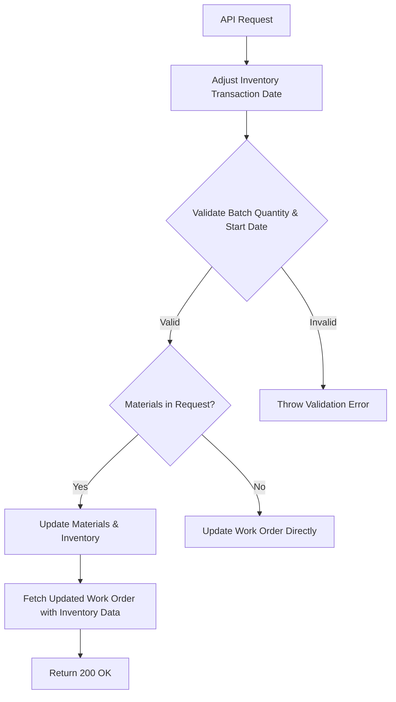

**Documentation for Management: Work Order Update API (v2)**  

---

### **1. Purpose**  
This API updates work orders with a focus on **recipe-driven manufacturing processes**. It ensures updates comply with production definitions, validates critical fields, and manages material/inventory adjustments (including rework items).  

---

### **2. Key Features**  
- **Recipe-Based Updates**: Updates work orders using predefined recipes (e.g., `recipe-name` parameter).  
- **Validations**:  
  - Validates batch quantity against the work definition.  
  - Ensures planned start date is in the future.  
- **Material Management**:  
  - Updates material quantities (e.g., ingredients, rework items).  
  - Creates inventory reservations for rework items (if work order is not completed).  
- **Inventory Sync**: Reflects real-time inventory levels post-update via SOAP API integration.  

---

### **3. Business Rules**  
| **Rule**                          | **Description**                                                                 |
|-----------------------------------|---------------------------------------------------------------------------------|
| **Recipe Compliance**             | Batch quantity must align with the recipe’s work definition.                    |
| **Planned Start Date**            | Start date must be in the future.                                               |
| **Material Updates**              | - Rework items trigger inventory reservations.   - Quantity changes require inventory adjustments. |
| **Inventory Transaction Date**    | Automatically adjusted to `59 seconds before` the provided timestamp.          |

---

### **4. Error Handling**  
- **404 Not Found**: Returned if the work order or recipe does not exist.  
- **Custom Exceptions**:  
  - `WorkOrderDomainException`: Invalid work order data (e.g., invalid batch quantity).  
  - `InventoryDomainException`: Inventory validation/reservation failures.  
- **Logging**: Detailed error logs for troubleshooting (e.g., inventory issues, invalid operations).  

---

### **5. Dependencies**  
- **External Systems**:  
  - **Inventory System**: Manages reservations and transactions.  
  - **Work Order Operations Service**: Provides current material/operation data.  
- **Authentication**: Azure token required for authorization.  

---

### **6. Process Flow**  

---

### **7. Key Scenarios**  
#### **Material Updates**  
- **Existing Materials**: Updates quantities if changed; skips if unchanged.  
- **New Materials**:  
  - Added to operations if compliant with the recipe.  
  - Rework items trigger inventory reservations (unless work order is completed).  

#### **Rework Item Handling**  
1. Validates inventory availability.  
2. Creates inventory transactions for quantity adjustments.  
3. Reserves inventory if work order is active.  

---

### **8. Limitations**  
- **Recipe Dependency**: Updates require a valid `recipe-name` tied to a work definition.  
- **Inventory Timing**: Inventory data is refreshed post-update, not real-time during the request.  
- **Rework Scope**: Only supports predefined rework items (e.g., `IngredientsService.ReworkItemNumber`).  

---

### **9. Technical Notes**  
- **Reactive Architecture**: Uses non-blocking operations for scalability.  
- **Audit Logging**: Logs key steps (e.g., date adjustments, material changes).  
- **HTTP Status**: Returns `200 OK` on success.  

---

**Revision History**  
- **v2**: Added recipe-based validation, rework inventory handling, and material synchronization.