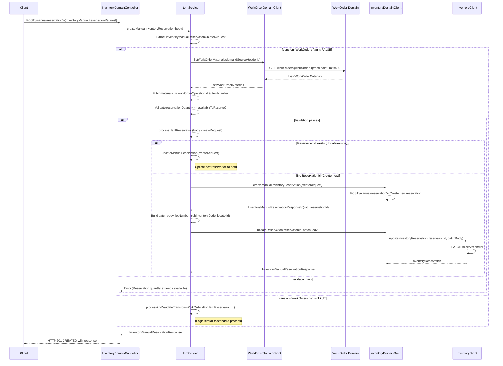

Below is a Mermaid sequence diagram that represents the flow for creating a manual inventory reservation, including the decision-making process for validating work order materials and either updating an existing reservation or creating a new one:

### Diagram Explanation

1. **Client Request:**  
   - The client sends a `POST /manual-reservation` request with an `InventoryManualReservationRequest`.

2. **Controller Layer:**  
   - The `InventoryDomainController` receives the request and calls the `createManualInventoryReservation` method in the `ItemService`.

3. **Service Layer Processing:**  
   - The service extracts the `InventoryManualReservationCreateRequest` from the input.
   - Based on the `transformWorkOrders` flag:
     - If **FALSE**, it calls `listWorkOrderMaterials` from the `WorkOrderDomainClient` to retrieve work order material details.
     - It then filters and validates that the requested reservation quantity does not exceed the available quantity.
     
4. **Hard Reservation Processing:**  
   - If validation passes:
     - **Update Flow:** If a reservation ID is provided, it updates the existing soft reservation by calling `updateManualReservation`.
     - **Create Flow:** If no reservation ID exists, it calls `createManualInventoryReservation` from the `InventoryDomainClient` to create a new reservation, then builds a patch body and calls `updateReservation` (which in turn calls `updateInventoryReservation` on the `InventoryClient`).
     
5. **Response Propagation:**  
   - The final `InventoryManualReservationResponse` is passed back up through the layers and returned to the client with HTTP status **201 CREATED**.

This sequence diagram provides a clear visual overview of the method calls and decision points in the manual inventory reservation flow.