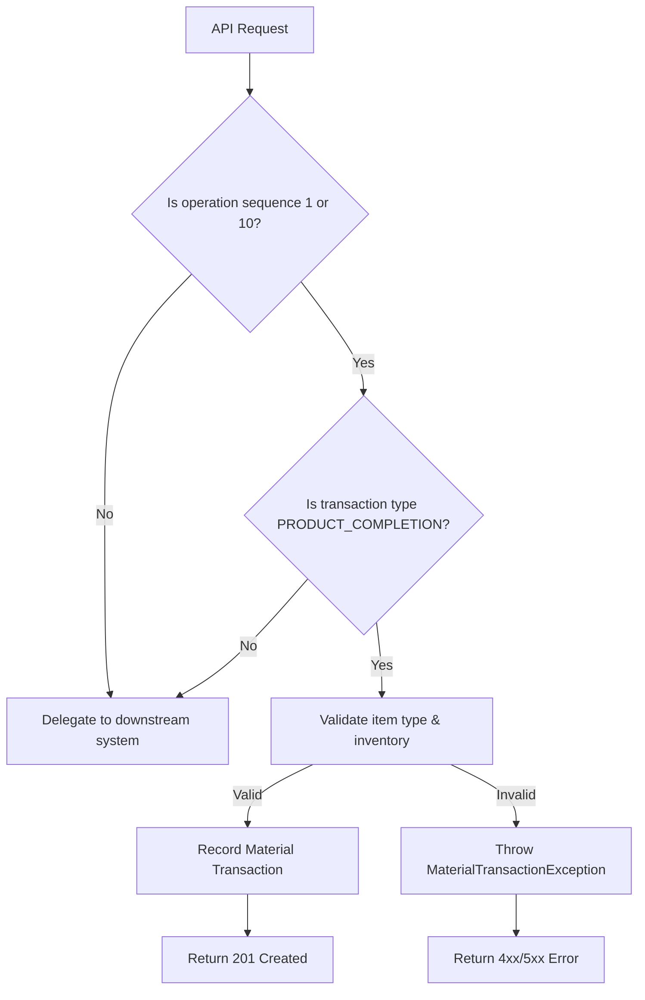

**Documentation for Management: Material Transaction Creation API (Product Yielding)**  

---

### **1. Purpose**  
This API enables the creation of material transactions for **product yielding** (e.g., "Master Rex" and "Filler Rex") during manufacturing. It ensures compliance with business rules for validating production steps and inventory reservations before recording transactions.

---

### **2. Key Features**  
- **Product Yielding**: Records material transactions when products are completed at specific stages (`operation sequence 1` or `10`).  
- **Validation Rules**:  
  - Only processes `PRODUCT_COMPLETION` transactions for valid operation sequences.  
  - Validates item type and inventory availability (hard reservations) for the product.  
- **Integration**: Delegates non-yielding transactions (e.g., non-`PRODUCT_COMPLETION`) to downstream systems.  

---

### **3. Business Rules**  
| **Rule**                          | **Description**                                                                 |
|-----------------------------------|---------------------------------------------------------------------------------|
| **Valid Operation Sequences**     | Transactions allowed only for `operation sequence 1` or `10`.                  |
| **Transaction Type**              | Must be `PRODUCT_COMPLETION` to trigger internal validations.                  |
| **Inventory Check**               | Validates hard reservations for the product before recording the transaction.  |

---

### **4. Error Handling**  
- **404 Not Found**: Returned if the product or work order does not exist.  
- **Custom Exceptions**:  
  - `MaterialTransactionException`: Thrown for invalid item types, missing reservations, or downstream errors.  
  - Errors include contextual messages (e.g., "Insufficient inventory for product X").  

---

### **5. Limitations**  
- **Scope**: Only processes `PRODUCT_COMPLETION` transactions. Other transaction types (e.g., scrap, returns) are delegated to external systems.  
- **Sequence Dependency**: Only applicable to operations `1` and `10`. Other sequences bypass internal logic.  

---

### **6. Dependencies**  
- **External Services**:  
  - **Inventory System**: Validates hard reservations.  
  - **Downstream Transaction Service**: Handles non-yielding transactions.  
- **Authentication**: Requires Azure token for authorization.  

---

### **7. Process Flow**  

---

### **8. Technical Notes**  
- **Reactive Design**: Uses non-blocking operations for high scalability.  
- **Audit Logging**: Logs transaction details and errors for traceability.  
- **HTTP Status**: Returns `201 Created` on success (documentation mentions `200 OK`; alignment needed).  

---

**Revision History**  
- **v1**: Initial release with support for product yielding and inventory validation.