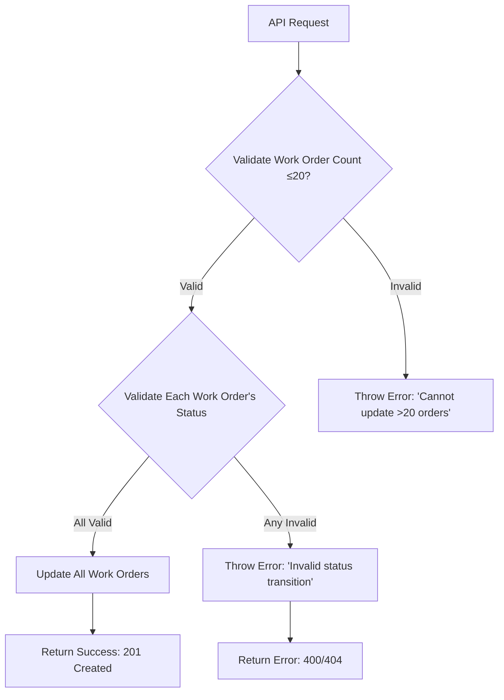

**Documentation for Management: Work Order Status Update API**

---

### **1. Purpose**
This API allows bulk updating of work order statuses, ensuring efficient and controlled transitions (e.g., "Release" or "Unrelease") for multiple work orders in a single request. It enforces business rules to prevent invalid or excessive updates.

---

### **2. Key Features**
- **Bulk Processing**: Update statuses for up to **20 work orders** in one request.
- **Validations**:
  - **Limit Checks**: Blocks requests exceeding 20 work orders for "ORA_RELEASED" or "ORA_UNRELEASED" statuses.
  - **Status Transition Rules**: Validates if each work order can transition to the requested status (e.g., prevents releasing an already released order).
- **Atomic Updates**: Processes all updates successfully or fails entirely (no partial updates).
- **Audit Logging**: Tracks API responses for troubleshooting and compliance.

---

### **3. Validations & Business Rules**
| **Rule**                          | **Description**                                                                 |
|-----------------------------------|---------------------------------------------------------------------------------|
| **Max 20 Work Orders**            | Applies only to "ORA_RELEASED" and "ORA_UNRELEASED" status updates.             |
| **Valid Status Transitions**      | Ensures work orders are in a state that allows the requested status change.     |
| **Valid Work Order IDs**          | Rejects invalid/non-numeric IDs or IDs not found in the system.                 |

---

### **4. Error Handling**
- **404 Not Found**: Returned if any work order ID is invalid or missing.
- **Custom Exceptions**:  
  - `WorkOrderUpdateException`: Triggered for validation failures (e.g., exceeding 20 items, invalid transitions).
  - Errors include clear messages for easy troubleshooting (e.g., "Cannot Unrelease more than 20 work orders").

---

### **5. Limitations**
- **Batch Size**: Limited to 20 work orders for critical status changes ("Released"/"Unreleased").
- **All-or-Nothing**: Partial updates are not supported; entire batch fails on any validation error.
- **HTTP Status Note**: Returns `201 Created` on success (documentation mentions `200 OK`; alignment needed).

---

### **6. Dependencies**
- **External Services**: Integrates with:
  - **WorkOrderService**: Fetches work order details for validation.
  - **Downstream Client**: Executes the actual status updates in the system.
- **Authentication**: Requires Azure token for authorization.

---

### **7. Process Flow**

---

### **8. Technical Considerations**
- **Reactive Programming**: Uses non-blocking operations (Spring WebFlux) for high concurrency.
- **Parallel Processing**: Updates work orders asynchronously for faster throughput.

---

**Revision History**  
- **v2**: Added bulk validations, atomic updates, and enhanced error handling.